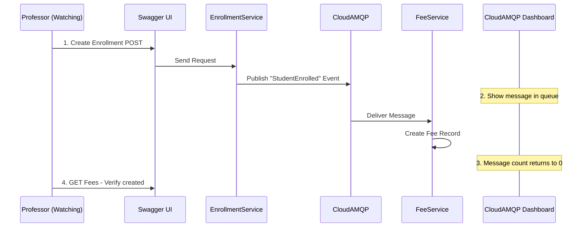

# RabbitMQ Live Demo Guide

## Step-by-Step Guide to Demonstrate RabbitMQ Message Flow

This guide shows how to demonstrate the RabbitMQ (CloudAMQP) event-driven messaging system in your College Management System.

---

## 🎯 Demo Scenario

**Event Flow**: When a student enrolls in a course, the system automatically creates a fee record using RabbitMQ messaging.

```
Student Enrolls → EnrollmentService publishes "StudentEnrolled" event 
                → RabbitMQ Queue 
                → FeeService subscribes and creates fee record
```

---

## 📋 Prerequisites

Before starting the demo:
1. ✅ All services running (use VS 2022 or PowerShell script)
2. ✅ At least one student created
3. ✅ At least one course created
4. ✅ CloudAMQP account credentials ready

---

## 🌐 Part 1: Access CloudAMQP Management Dashboard

### Step 1: Login to CloudAMQP
1. Open browser and go to: **https://customer.cloudamqp.com/**
2. Login with your CloudAMQP account credentials
3. Click on your RabbitMQ instance (the one you're using in the project)

### Step 2: Open RabbitMQ Manager
1. Click the **"RabbitMQ Manager"** button
2. This opens the RabbitMQ Management Console
3. Keep this tab open during the demo

### Step 3: Navigate to Queues Tab
1. In RabbitMQ Manager, click **"Queues"** tab
2. You should see your queue: **`student-enrolled-queue`**
3. Note the current message count (should be 0 initially)

---

## 🔧 Part 2: Prepare API Testing Tools

### Option 1: Using Swagger UI (Recommended)

**1. Open API Gateway Swagger:**
```
https://localhost:7000/swagger
```

**2. Open Individual Service Swaggers (for detailed view):**
- Enrollment Service: https://localhost:7003/swagger
- Fee Service: https://localhost:7004/swagger

### Option 2: Using Postman
Import the following collections or create manual requests (shown below).

---

## 🎬 Part 3: Live Demo Steps

### Step 1: Create a Student (if not exists)

**API Endpoint:**
```
POST https://localhost:7000/api/Student
```

**Request Body:**
```json
{
  "firstName": "Rahul",
  "lastName": "Kumar",
  "email": "rahul.kumar@college.edu",
  "dateOfBirth": "2002-05-15",
  "enrollmentDate": "2024-01-15"
}
```

**Expected Response:**
- Status: 201 Created
- Response body with student details and `studentId`
- **Note the `studentId` for next step**

---

### Step 2: Create a Course (if not exists)

**API Endpoint:**
```
POST https://localhost:7000/api/Course
```

**Request Body:**
```json
{
  "courseCode": "CS101",
  "courseName": "Introduction to Computer Science",
  "credits": 3,
  "departmentId": 1
}
```

**Expected Response:**
- Status: 201 Created
- Response body with `courseId`
- **Note the `courseId` for next step**

---

### Step 3: ⭐ THE MAIN DEMO - Create Enrollment (Triggers RabbitMQ)

**Before executing:**
1. Switch to CloudAMQP RabbitMQ Manager
2. Keep the **Queues** tab visible
3. Watch the `student-enrolled-queue`

**API Endpoint:**
```
POST https://localhost:7000/api/Enrollment
```

**Request Body:**
```json
{
  "studentId": 1,
  "courseId": 1,
  "enrollmentDate": "2024-01-15",
  "grade": null
}
```

**Expected Response:**
- Status: 201 Created
- Response body with enrollment details

---

### Step 4: 🎯 Observe RabbitMQ Message Flow

**In CloudAMQP RabbitMQ Manager:**

1. **Immediately after creating enrollment**, you should see:
   - Message count briefly increases to 1 in `student-enrolled-queue`
   - Message is consumed almost instantly by FeeService
   - Count returns to 0 (message processed)

2. **Check Message Rates Graph:**
   - Shows spike in publish/deliver rates
   - Demonstrates real-time messaging

---

### Step 5: Verify Fee Record Created

**API Endpoint:**
```
GET https://localhost:7000/api/Fee
```

**Expected Response:**
- Status: 200 OK
- Array containing fee records
- **Find the fee record for the enrollment you just created**
- Fee amount should be auto-calculated based on course credits

**Example Response:**
```json
[
  {
    "feeId": 1,
    "studentId": 1,
    "amount": 15000.00,
    "dueDate": "2024-02-15",
    "isPaid": false,
    "enrollmentId": 1
  }
]
```

---

## 🎤 What to Explain to Your Professor

### 1. **Event-Driven Architecture**
> "When I create an enrollment, the EnrollmentService doesn't directly call FeeService. Instead, it publishes a 'StudentEnrolled' event to RabbitMQ."

### 2. **Loose Coupling**
> "The EnrollmentService doesn't need to know about FeeService. They communicate through RabbitMQ, making the system loosely coupled and scalable."

### 3. **Asynchronous Processing**
> "The fee record is created asynchronously. Even if FeeService is down temporarily, the message stays in the queue until it can be processed."

### 4. **Message Persistence**
> "CloudAMQP ensures messages are persisted. Even if RabbitMQ crashes, messages won't be lost."

---

## 📊 Advanced Demo: Check Message Details

### In RabbitMQ Manager:

1. **Go to Queues → student-enrolled-queue**
2. Click **"Get Messages"** section
3. Set count to 1
4. Click **"Get Message(s)"**
5. If there's a message in queue, you'll see:

```json
{
  "enrollmentId": 1,
  "studentId": 1,
  "courseId": 1,
  "enrollmentDate": "2024-01-15T00:00:00"
}
```

**Note:** Messages are consumed very quickly, so you might need to create multiple enrollments rapidly to catch a message in the queue.

---

## 🔄 Demo Workflow Summary



---

## 🎯 Quick Demo Checklist

☐ **Preparation:**
  - [ ] Start all services in VS 2022
  - [ ] Open CloudAMQP dashboard
  - [ ] Open RabbitMQ Manager → Queues tab
  - [ ] Open API Gateway Swagger

☐ **Demo Execution:**
  - [ ] Explain the architecture
  - [ ] Show CloudAMQP queue (empty)
  - [ ] Create enrollment via Swagger
  - [ ] Point to CloudAMQP - show message flow
  - [ ] Verify fee record created
  - [ ] Explain benefits (loose coupling, async, scalability)

☐ **Optional Extras:**
  - [ ] Show connection details in appsettings.json
  - [ ] Explain CloudAMQP free tier vs paid
  - [ ] Discuss alternative: Self-hosted RabbitMQ

---

## 🔑 CloudAMQP Configuration (Show in Code)

**File:** `Backend/CMS.EnrollmentService/appsettings.json`

```json
{
  "RabbitMQ": {
    "HostName": "your-cloudamqp-url.rmq.cloudamqp.com",
    "UserName": "your-username",
    "Password": "your-password",
    "VirtualHost": "your-vhost",
    "QueueName": "student-enrolled-queue"
  }
}
```

**Explain:** These are CloudAMQP credentials that connect our services to the message broker.

---

## 💡 Troubleshooting

**If messages aren't flowing:**
1. Check all services are running
2. Verify CloudAMQP credentials in appsettings.json
3. Check RabbitMQ connections in CloudAMQP dashboard
4. Look at service console logs for errors

**If queue doesn't exist:**
- The queue is auto-created when FeeService starts
- Restart FeeService if needed

---

## 🎓 Key Points to Highlight

1. **Microservices Communication** - Services communicate via events, not direct HTTP calls
2. **Scalability** - Can add more consumers (FeeService instances) without changing EnrollmentService
3. **Reliability** - Messages persist even if consumer is temporarily down
4. **Real-time** - Message delivery happens in milliseconds
5. **Cloud-based** - Using managed CloudAMQP service (no infrastructure management)

---

**Good luck with your demo! 🚀**
