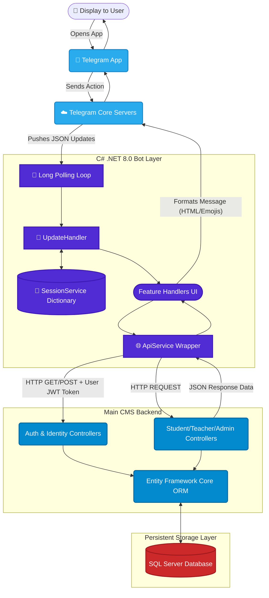
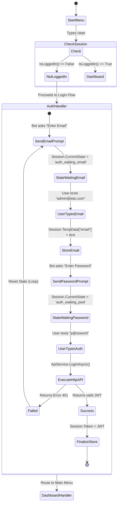
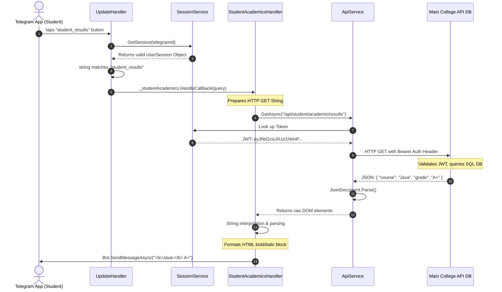

 🤖 CMS Telegram Bot Service - Master Architecture & Extreme Developer Deep Dive Guide

Welcome to the **College Management System (CMS) Telegram Bot**! This service provides a fully operational, highly reactive Telegram interface allowing Students, Teachers, and Administrators to interact directly with the main CMS application globally from their mobile devices or desktop computers.

This document serves as the absolute, definitive, **exhaustive master technical guide**. It is designed specifically for computer science and software engineering students. It aims to tear away the "magic" of how bots work and explicitly detail **every single architectural design decision, code piece, and data flow** within this system. By reading this document, you will profoundly understand enterprise-level C# .NET 8 API construction, dependency injection, and state machine design.

---

## 🌟 Table of Contents
1. [Introduction to the Bot Service](#1-introduction-to-the-bot-service)
2. [Master System Architecture Diagram](#2-master-system-architecture-diagram)
3. [The "Middleman" API Client Pattern Explained](#3-the-middleman-api-client-pattern-explained)
4. [Startup & Bootstrapping (`Program.cs`)](#4-startup--bootstrapping-programcs)
5. [Connecting to Telegram: Long Polling vs Webhooks](#5-connecting-to-telegram-long-polling-vs-webhooks)
6. [The Traffic Router: Understanding `UpdateHandler.cs`](#6-the-traffic-router-understanding-updatehandlercs)
7. [Dependency Injection (DI) & Modular Architecture](#7-dependency-injection-di--modular-architecture)
8. [The Core Problem: Statelessness](#8-the-core-problem-statelessness)
9. [The Solution: State Machines & `SessionService.cs`](#9-the-solution-state-machines--sessionservicecs)
   - 9.1 Interactive Authentication State Diagram
10. [Bridging the Database: `ApiService.cs`](#10-bridging-the-database-apiservicecs)
    - 10.1 Automatic JWT Token Injection
11. [Exhaustive Breakdown: Feature Handlers (`/Handlers/`)](#11-exhaustive-breakdown-feature-handlers-handlers)
    - 11.1 Global / Core Handlers
    - 11.2 The Administrator Handlers
    - 11.3 The Teacher Modules
    - 11.4 The Student Modules
12. [Visualizing the Code: User Request Sequence Diagram](#12-visualizing-the-code-user-request-sequence-diagram)
13. [Step-by-Step Scenario Tracing](#13-step-by-step-scenario-tracing)
    - Scenario A: A Teacher marking attendance for a class
    - Scenario B: A Student viewing their academic profile
14. [Local Development & Setup Guide](#14-local-development--setup-guide)
15. [Advanced Concepts for Seniors](#15-advanced-concepts-for-seniors)

---

## 🚀 1. Introduction to the Bot Service

In modern web development, creating a web portal is often not enough. Users demand instant notifications, mobile-first interfaces, and frictionless access to their data. Instead of forcing students to download a heavy Android/iOS application or rely on mobile web browsers, this project leverages the **Telegram Ecosystem**.

The `CMS.TelegramService` is a standalone `.NET 8 Web (Console) Application`. It does *not* possess its own database. It does *not* calculate grades or enforce business logic regarding tuition limits. It acts entirely as an **Intelligent Presentation Layer (Frontend)** built inside a messaging application. It connects to the primary **CMS Backend REST API**, authenticates on behalf of the user, formats the raw JSON data received from the API into human-readable HTML messages with interactive inline keyboards, and sends them to the end user.

---

## 🏗️ 2. Master System Architecture Diagram

This mermaid flowchart outlines the exact infrastructure deployed for this project.



---

## 🔌 3. The "Middleman" API Client Pattern Explained

A common mistake made by junior developers is to build the Telegram bot *directly* into the main ASP.NET API, establishing direct database connections via Entity Framework within the bot logic.

**Why is that bad?**
If you hardcode SQL queries inside your Telegram Bot, what happens when you want to build a React website tomorrow? Or a Flutter mobile app? You would have to rewrite all the database logic.

**The Middleman Architecture:**
This project utilizes the **Microservice** (or layered service) approach. 
The main CMS Backend handles all database connections, validation, and complex math. It exposes "Endpoints" like `GET /api/attendance`.
Our Telegram Bot is essentially just another browser. It is a client. It asks the API for data, receives JSON, and reformats it. If the API changes its endpoint structure, we only update the bot's HTTP calls. We never touch database contexts within this repository.

---

## 🚀 4. Startup & Bootstrapping (`Program.cs`)

`Program.cs` is the absolute entry point of the C# application. In .NET 8, it utilizes Top-Level Statements to drastically reduce boilerplate code.

### 4.1 Loading Configuration
Every environment (Local Development vs Production Server) requires different connection strings. The bot relies on `appsettings.json`.

```json
// Example appsettings.json
{
  "BotConfiguration": {
    "BotToken": "123456789:ABCDEF_GHIJKLMNOPQRSTUVWXYZ",
    "ApiBaseUrl": "https://localhost:7000" 
  }
}
```
In `Program.cs`, we extract these secrets securely:
```csharp
var builder = WebApplication.CreateBuilder(args);
var botToken = builder.Configuration["BotConfiguration:BotToken"]
    ?? throw new Exception("BotToken not configured in appsettings.json");
```
*Note: We throw an exception immediately if the token is missing. It is better for an application to crash instantly on startup (Fail Fast) rather than run silently corrupted.*

### 4.2 Initializing The Bot Client
```csharp
builder.Services.AddSingleton<ITelegramBotClient>(new TelegramBotClient(botToken));
```
We inject the core Telegram library into the application. This object handles the actual TCP/IP communication to Telegram's cloud.

---

## 📡 5. Connecting to Telegram: Long Polling vs Webhooks

There are two primary ways a bot can receive messages from Telegram:

1.  **Webhooks (Pull strategy):** You give Telegram a highly secure HTTPS URL (e.g., `https://mycollege.edu/bot-webhook`). When a user messages your bot, Telegram initiates an HTTP POST request to your server. 
    *   *Pros:* Extremely efficient, uses zero server resources when idle.
    *   *Cons:* Requires SSL certificates, public IP addresses, and complex DNS setups. Hard to test locally.

2.  **Long Polling (Push strategy):** This is what we use in `Program.cs`. 
    *   The bot reaches out to Telegram and says: *"Hey, do you have any new messages? If not, keep this connection open for up to 50 seconds and let me know the moment one arrives."*
    *   *Pros:* Will work on your laptop behind a router firewall! No public IP needed. Extremely reliable.

### 5.1 The Loop Mechanism
```csharp
// Program.cs
botClient.StartReceiving(
    updateHandler: async (bot, update, ct) =>
    {
        // This entire block fires asynchronously the millisecond a user texts the bot
        try
        {
            await updateHandler.HandleUpdateAsync(update);
        }
        catch (Exception ex)
        {
            Console.WriteLine($"[ERROR] {ex.Message}");
        }
    },
    errorHandler: (bot, ex, src, ct) => { ... },
    cancellationToken: cts.Token
);
```

---

## 🚦 6. The Traffic Router: Understanding `UpdateHandler.cs`

Once the `StartReceiving` loop detects a message, it immediately passes the massive JSON object (known as an `Update`) to `UpdateHandler.cs`. 

Think of `UpdateHandler` as a massive train yard switching station. It looks at the incoming cargo and routes the train to the correct track.

### 6.1 Differentiating Message Types
Telegram users can interact in many ways. They can type words (`Message`), they can tap inline buttons (`CallbackQuery`), or they can edit previous messages.

```csharp
public async Task HandleUpdateAsync(Update update)
{
    if (update.Type == UpdateType.Message && update.Message?.Text != null)
        await HandleMessageAsync(update.Message);
    else if (update.Type == UpdateType.CallbackQuery && update.CallbackQuery != null)
        await HandleCallbackAsync(update.CallbackQuery);
}
```

### 6.2 Routing Based on String Prefixes (Callback Queries)
When a user clicks a button like `[View Students]`, Telegram sends a hidden string to the bot, let's say: `"admin_students"`.

The `HandleCallbackAsync` method intercepts this:
```csharp
var data = query.Data ?? "";

// The Router checks prefixes!
if (data.StartsWith("admin_students") || data.StartsWith("view_student_")) 
    await _adminStudents.HandleCallback(query);
else if (data.StartsWith("admin_courses")) 
    await _adminCourses.HandleCallback(query);
else if (data == "teacher_classes") 
    await _teacherClasses.HandleCallback(query);
```
*Design Pattern Note:* Why do we use `.StartsWith`? Because often we need to pass dynamic IDs. A button to view student ID 1500 might hold the callback string `"view_student_1500"`. The router routes anything starting with `"view_student_"` to the Student Handler, which then extracts "1500" to query the API!

---

## 💉 7. Dependency Injection (DI) & Modular Architecture

In legacy C# applications, developers would write code like this inside the `UpdateHandler`:
```csharp
// BAD, TIGHTLY COUPLED CODE:
var studentHandler = new StudentsHandler(botClient);
await studentHandler.HandleCallback(query);
```
**The Modern Way (DI):**
In `.NET 8`, we use an Inversion of Control (IoC) Container. 
In `Program.cs`, we register our services:
```csharp
builder.Services.AddSingleton<CMS.TelegramService.Handlers.Admin.StudentsHandler>();
```

Then, in `UpdateHandler.cs`, we ask the constructor to simply *give* us those objects:
```csharp
public class UpdateHandler
{
    private readonly StudentsHandler _adminStudents;
    
    // The framework auto-fills this constructor with the Singletons from Program.cs!
    public UpdateHandler(StudentsHandler adminStudents) 
    {
        _adminStudents = adminStudents;
    }
}
```
This is **Separation of Concerns**. The `UpdateHandler` does not know *how* to build a Student dashboard. It just knows *who* to hand the incoming message to. 

---

## 🧠 8. The Core Problem: Statelessness

Building a conversational bot is vastly different from building a static website. 

Imagine a Teacher wants to record an Exam Grade. Inside Telegram, the conversation looks like this:
1.  **Bot:** What is the Course ID?
2.  **Teacher:** Math101
3.  **Bot:** What is the Student's ID?
4.  **Teacher:** 9876
5.  **Bot:** What are the marks out of 100?
6.  **Teacher:** 85

**THE FATAL FLAW:** Telegram memory resets on every text. When the teacher types "85" (line 6), Telegram sends the bot a message containing literally just the text "85". 
The bot says: *"What is 85? Who are you? What student? What course?"*

HTTP APIs and Telegram Webhooks are **stateless**. They do not remember the previous message.

---

## 💾 9. The Solution: State Machines & `SessionService.cs`

To solve statelessness, we explicitly designed a custom In-Memory Storage system via `SessionService.cs`. 

It maintains a gigantic server-side Dictionary:
```csharp
// Key = User's Telegram ID (e.g., 554321)
// Value = A complex UserSession memory block
private readonly Dictionary<long, UserSession> _sessions = new();
```

### 9.1 The `UserSession` Class
Here is what we actually store in RAM for every single active user:
```csharp
public class UserSession
{
    public long UserId { get; set; }           // Their DB ID (e.g. 5)
    public string Role { get; set; } = "";     // "Admin", "Teacher", "Student"
    public string Token { get; set; } = "";    // The highly secure JWT Authorization Token
    
    // State Tracking!
    public string CurrentState { get; set; } = ""; // e.g. "tch_exam_waiting_marks"
    
    // Custom Memory Storage for long flows
    public Dictionary<string, string> TempData { get; set; } = new(); 
    // e.g. TempData["StudentId"] = "9876"
    // e.g. TempData["CourseId"] = "Math101"
}
```

### 9.2 Stateful Routing in `UpdateHandler`
If a user just types plain text ("85"), the `UpdateHandler` looks at their session state before doing *anything*.

```csharp
var state = _sessions.GetState(userId); // Result: "auth_waiting_password"

if (state.StartsWith("auth_")) 
    await _auth.HandleState(msg, state);
    // Routes text "password123" to Auth Handler
else if (state.StartsWith("tch_exam_")) 
    await _teacherExams.HandleState(msg, state);
    // Routes text "85" to the Exam Handler, which knows it was waiting for marks
```

### 9.3 Interactive Authentication State Diagram
Here is a visual map of how `SessionService` moves a user through the authentication flow step-by-step:



---

## 🌐 10. Bridging the Database: `ApiService.cs`

As reiterated, the bot cannot run raw SQL queries. It relies on the primary ASP.NET REST Backend. 
Writing native `HttpClient` requests gets messy fast. Therefore, `ApiService.cs` was engineered to wrap all HTTP interaction cleanly.

### 10.1 Automatic JWT Token Injection
The most crucial security mechanism is the JSON Web Token (JWT). When a user successfully authenticates once, the Backend API drops a cryptographic Token representing their session. Every *subsequent* request to the backend must include this token in the `Authorization` header.

The `ApiService` handles this globally:
```csharp
private HttpClient CreateClient(long telegramId)
{
    // Retrieve standard HttpClient mapped to our BaseURL
    var client = _factory.CreateClient("api");
    client.BaseAddress = new Uri(_baseUrl);
    
    // Look up the user's specific JWT from the dictionary
    var token = _sessions.GetToken(telegramId);
    
    // Inject into headers globally
    if (!string.IsNullOrEmpty(token))
        client.DefaultRequestHeaders.Authorization = new AuthenticationHeaderValue("Bearer", token);
        
    return client;
}
```
This implies the developer writing the `TeacherClassesHandler` never needs to worry about tokens. They simple write:
`await _api.GetAsync(telegramId, "/api/teacher/classes");`
and `ApiService` handles the encryption automatically under the hood!

### 10.2 JSON Deserialization Strategy
Most API Clients map objects tightly to models (e.g. `JsonSerializer.Deserialize<Student>(body)`). 
Because the Bot is just a UI layer, we use raw `JsonDocument` DOM parsing. We just extract what we need to render the HTML screen. We do not maintain redundant C# models in the bot service.

```csharp
// In ApiService.cs:
var doc = JsonDocument.Parse(body).RootElement;
return (doc, null); // Returns a flexible raw DOM element
```

---

## 🏗️ 11. Exhaustive Breakdown: Feature Handlers (`/Handlers/`)

By grouping distinct features into independent classes, multiple developers can work on the Telegram Bot simultaneously without causing Merge Conflicts in Git.

### 11.1 Global / Core Handlers
*   **`AuthHandler.cs`**: Handles the meticulous multi-step email/password collection via the State Machine. Communicates directly with the backend's `POST /api/auth/login` endpoint. It parses the resulting JWT to assign Roles.
*   **`MenuHandler.cs`**: The visual heart of the dashboard. When triggered, it identifies the user's role and constructs a dynamic grid of Inline Buttons using the `InlineKeyboardMarkup` array system. *If you are an Admin, it pulls statistics from four different databases to generate your welcome screen!*

### 11.2 The Administrator Handlers (`/Handlers/Admin/`)
Admins possess ultimate power in the bot. Their handlers utilize extensive pagination to prevent Telegram character limit crashes.
*   **`StudentsHandler.cs`**: Can list pagination of thousands of students. Includes callbacks `"view_student_ID"` to drill down into a profile, and sub-states to Approve or Reject pending student registrations via `PUT /api/student/{id}/status`.
*   **`TeachersHandler.cs`**: Similar structure but filters the `users` table for Faculty roles.
*   **`CoursesHandler.cs`**: Views the active syllabuses offered. 
*   **`FeesHandler.cs`**: Injects logic to aggregate financial arrays. It loops over the returned data, comparing `status == Paid`, allowing an admin to instantly see "Total Collected" vs "Pending Debt".
*   **`AttendanceHandler.cs`**: The administrative overview displaying overall institutional metrics.
*   **`NoticesHandler.cs`**: Essential communication system.
*   **`ExamsHandler.cs`**: Schedules and orchestrates marking periods.
*   **`TimetableHandler.cs`**: Modifies the global timetable matrices.
*   **`BroadcasterHandler.cs`**: A vastly complex State Machine flow. Prompts an admin to type a message, then pushes it out via `SendMessage()` to *all* active Telegram User Sessions locally.
*   **`GroupRegistrationHandler.cs`**: Connects Telegram Group Chats directly to CMS class groups.
*   **`ImpersonateHandler.cs`**: High Security DevTool: Allows an Admin to forcefully alter their own `Session.Role` to view the Bot interface purely as if they were a Student or Teacher to debug UX flow issues.

### 11.3 The Teacher Modules (`/Handlers/Teacher/`)
Faculty interaction flow:
*   **`TeacherClassesHandler.cs`**: Looks at the Teacher's unique DB ID, accesses `GET /api/teacher/classes`, and formats their weekly schedule.
*   **`TeacherAttendanceHandler.cs`**: The most complex logic implementation. First, triggers a callback to select the class. Second, pulls all enrolled students. Third, utilizes inline button callbacks (Check/X icons) to toggle attendance values in a temporary JSON array before committing via a bulk POST payload.
*   **`TeacherExamsHandler.cs`**: Used to post grades to the backend API seamlessly.

### 11.4 The Student Modules (`/Handlers/Student/`)
*   **`StudentProfileHandler.cs`**: Generates a standard HTML profile card. 
*   **`StudentAcademicsHandler.cs`**: Aggregates grades and attendance endpoints to show progress percentages visually.
*   **`StudentHubHandler.cs`**: An integrative dashboard pulling extra-curricular notices and personalized weekly timetables into a single scrollable Telegram message.

---

## 📽️ 12. Visualizing the Code: User Request Sequence Diagram

Let's trace the exact internal C# method execution when a Student taps "My Results" to view their grades. We will follow data through the entire dependency injected stack.



---

## 🕵️ 13. Step-by-Step Scenario Tracing

Let's examine actual source code logic mapped to real-world deployment scenarios:

### Scenario A: A Teacher marking attendance for a class
**Step 1:** The teacher types `/menu`. 
**Code executed:** `UpdateHandler` intercepts command. `SessionService` confirms user is logged in and identifies role as `Teacher`. Routes to `MenuHandler`.
**Result:** Dashboard generated showing Teacher-specific buttons.

**Step 2:** The teacher taps `[✅ Take Attendance]`.
**Code executed:** Callback `"teacher_attendance"` fires. `UpdateHandler` maps it to `TeacherAttendanceHandler.HandleCallback()`. 
**Logic executed:** The handler hits `_api.GetAsync("/api/teacher/classes")`. It renders a list of the teacher's classes as new inline buttons, e.g. `[Math 101]` mapped to callback data `"tch_att_math101"`.

**Step 3:** The teacher taps `[Math 101]`.
**Code executed:** Callback triggers. The handler updates the memory: `Session.CurrentState = "tch_att_marking"`. It reaches to the API to pull students in Math 101. It constructs a grid of buttons.
`<Student Name> | [✅ Present]`
*(Under the hood, ✅ maps to callback "tch_toggle_studentID_absent", meaning tapping it changes the state).*

**Step 4:** The teacher finishes and taps `[Submit Matrix]`.
**Code Executed:** The bot collects the altered array stored quietly in the `TempData` session memory and issues a massive `_api.PostAsync("/api/attendance", massPayload)`. The backend Entity Framework commits to SQL.

### Scenario B: A Student viewing their academic profile
**Step 1:** The student taps `[👤 My Profile]`.
**Logic executed:** Callback data `student_profile` flies to `UpdateHandler`.
It is routed directly to `StudentProfileHandler.cs`.

**Code snippet mapping:**
```csharp
public async Task HandleCallback(CallbackQuery query) {
    var userId = query.From.Id;
    var session = _sessions.Get(userId);
    
    // Fallback error trap
    if (session == null) { 
        await _bot.SendMessage(query.Message!.Chat.Id, "Not logged in."); 
        return; 
    }

    // HTML Formatting with Emoji prefixing
    var text = $"👤 <b>My Profile</b>\n━━━━━━━━━━━━━━━━━━━━\n" +
               $"👤 <b>Name:</b> {session.Name}\n📧 <b>Email:</b> {session.Email}\n" +
               $"🎭 <b>Role:</b> {session.Role}\n🆔 <b>User ID:</b> <code>{session.UserId}</code>";
               
    // Append a Back tracking button dynamically           
    var kb = new InlineKeyboardMarkup(new[] { 
        new[] { InlineKeyboardButton.WithCallbackData("🔙 Back", "main_menu") } 
    });
    
    // Execute sending routine to cloud
    await _bot.SendMessage(query.Message!.Chat.Id, text, parseMode: ParseMode.Html, replyMarkup: kb);
}
```

---

## 🛠️ 14. Local Development & Setup Guide

Do you want to run this incredible system on your own local compiler machine? Follow these exact deployment protocols.

### Stage 1: The Core Backend Prerequisite
The bot **will crash** if it has no data source. You must compile and run the monolithic `CMS.Backend` REST API project first. 
Ensure it is successfully running and returning Swagger UI, generally on `https://localhost:7000`.

### Stage 2: Provisioning a Cloud Bot Instance
You must register a new cloud identity inside the Telegram ecosystem.
1. Download Telegram.
2. Search for the user `@BotFather` (the official master bot).
3. Send the message `/newbot`.
4. Provide a display name (e.g. `University UMS Bot`).
5. Provide a unique username ending in `bot` (e.g. `HarvardUmsTestBot`).
6. **Critically Important:** The BotFather will return an HTTP API Token (a long string of numbers and letters). Protect this like a password.

### Stage 3: Injecting Secrets to Configuration
Navigate to `Backend/CMS.TelegramService/`. Create or modify the file `appsettings.json`.

```json
{
  "Logging": {
    "LogLevel": {
      "Default": "Information",
      "Microsoft.AspNetCore": "Warning"
    }
  },
  "AllowedHosts": "*",
  "BotConfiguration": {
    "BotToken": "PLACE_YOUR_SECRET_TOKEN_FROM_BOTFATHER_HERE",
    "ApiBaseUrl": "https://localhost:7000" 
  }
}
```

### Stage 4: Network Compilation & Execution
Open your terminal inside the `CMS.TelegramService` directory containing the `.csproj` file.
Execute the .NET Core build process:

```bash
dotnet restore
dotnet build
dotnet run
```
You should see a console output verifying the connection to the long polling architecture:
*> `🤖 CMS Telegram Bot (.NET) starting...`*
*> `✅ Bot is running as: @YourBotName`*

Open Telegram on your smartphone, search your bot, and interact directly with your localized C# code logic in real time!

---

## 🎓 15. Advanced Concepts for Seniors

For fourth-year software engineering students, observe the following advanced architectural implementations inherent in this repository:

1.  **Asynchronous I/O Programming:** Notice how every method definition utilizes `public async Task` and almost every instruction is prefixed with `await`. In massive systems (like processing thousands of student messages concurrently), utilizing C# Tasks prevents thread-blocking. A polling server utilizing `await` can maintain 100,000 active web hook requests simultaneously using only a tiny fraction of system RAM compared to synchronous thread-per-request models.
2.  **Graceful Cancellation:** Inside `Program.cs`, we instantiate a `CancellationTokenSource`. If the linux server admin presses `Ctrl+C`, instead of killing the process and instantly dropping all API tasks mid-flight, the token is passed to `StartReceiving()`, permitting complex network shutdown handshakes to finish.
3.  **Encapsulated Formatting:** The user aesthetics (HTML wrappers, emojis) are completely abstracted out into `Utils/FormattingUtils.cs`. If the college rebrands its emoji scheme or demands generic formatting changes, the developer only alters one single file rather than crawling through 20 separate Handler classes.
4.  **Error Bubbling Protocol:** If an error occurs in the HTTP layer (a 500 Server error), `ApiService.cs` swallows the hard crash stack trace, converts it to a user-readable error, and bubbles it back up so the UI Handler can decide whether to display *"Network Failure"* or *"Database Connection Lost"*. This secures backend implementation details from leaking to typical users via Telegram.

***

