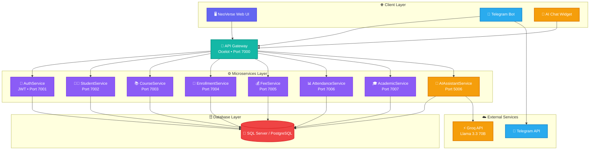
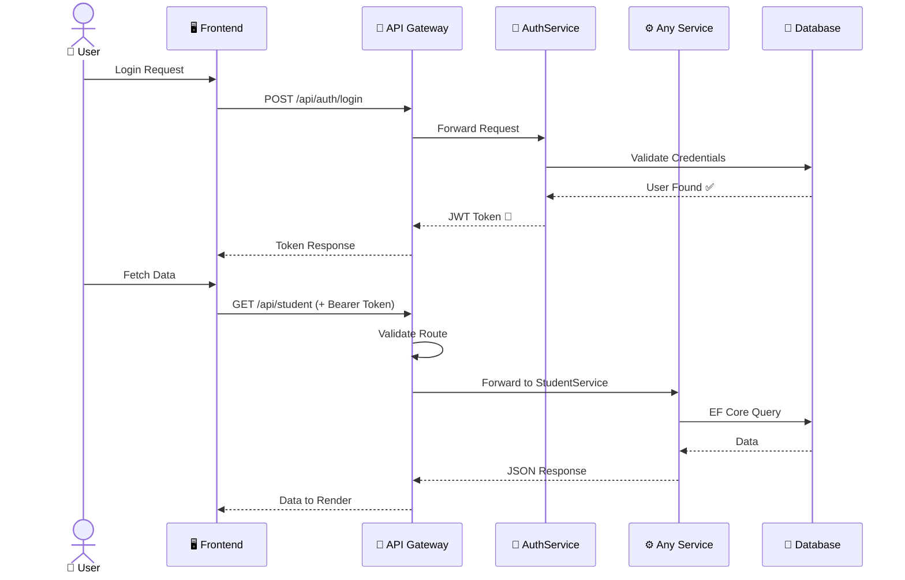
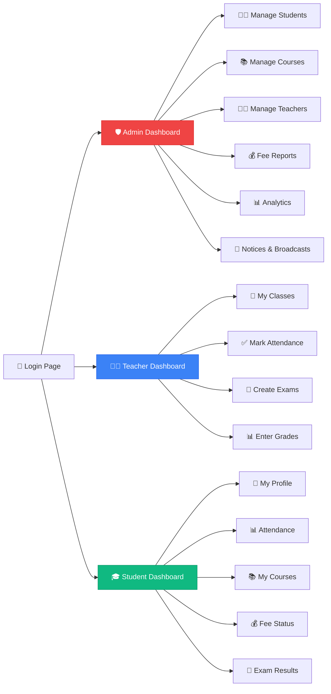
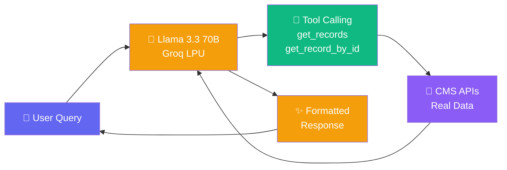
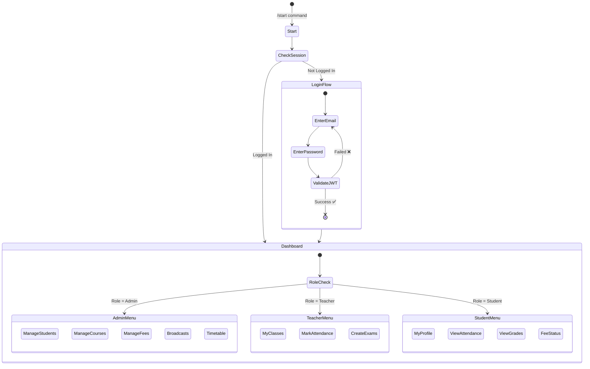
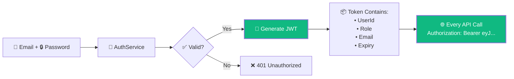
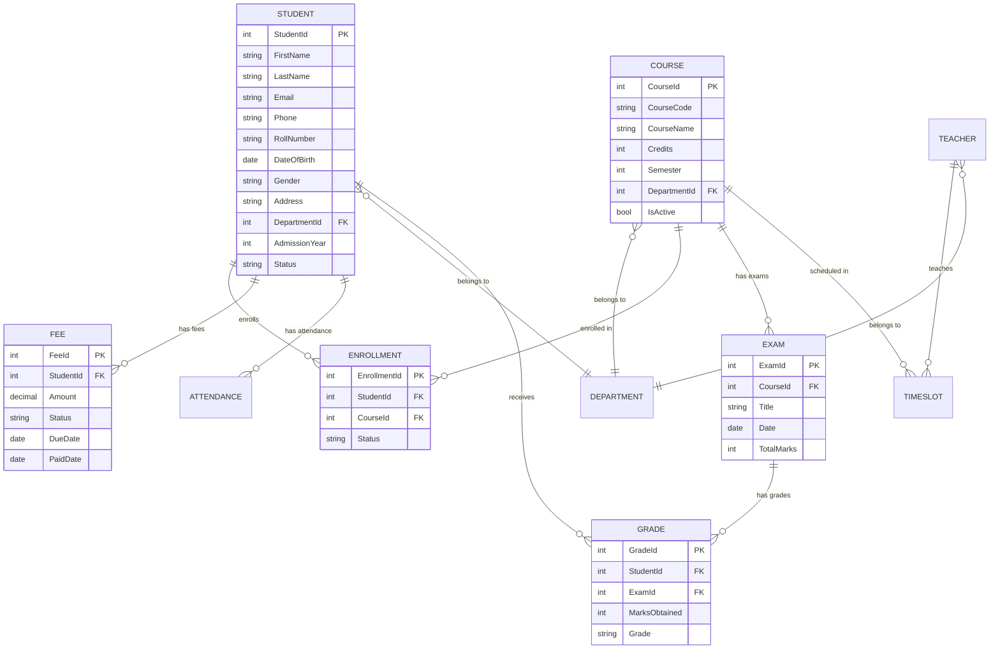

<div align="center">

# 🎓 NeoVerse CMS

### *A Next-Generation College Management System*


---

🚀 **A beautifully crafted microservices platform for modern educational institutions**
**Real-time analytics • Smart scheduling • AI-powered chatbot • Telegram integration**

[🌐 Live Demo](#-deployment) · [📖 Documentation](#-architecture) · [⚡ Quick Start](#-quick-start) · [🤖 AI Chatbot](#-ai-chatbot-service) · [📱 Telegram Bot](#-telegram-bot)

</div>

---

## 📋 Table of Contents

- [✨ Features](#-features)
- [🏗️ Architecture](#️-architecture)
- [🧩 Microservices](#-microservices)
- [🖥️ Frontend](#️-frontend)
- [🤖 AI Chatbot Service](#-ai-chatbot-service)
- [📱 Telegram Bot](#-telegram-bot)
- [🔐 Authentication & Security](#-authentication--security)
- [🗄️ Database Design](#️-database-design)
- [📡 API Gateway & Routing](#-api-gateway--routing)
- [🐳 Docker & Deployment](#-docker--deployment)
- [⚡ Quick Start](#-quick-start)
- [🛠️ Tech Stack](#️-tech-stack)
- [📂 Project Structure](#-project-structure)
- [🤝 Contributing](#-contributing)
- [📜 License](#-license)

---

## ✨ Features

<table>
<tr>
<td width="50%">

### 👨‍🎓 Student Management
- 📝 Complete student lifecycle (admission → graduation)
- 👤 Detailed student profiles with contact info
- 🎓 Roll number & department tracking
- 📊 Status management (Active / Inactive / Graduated / Suspended)

### 📚 Course & Enrollment
- 📖 Full course catalog with credit system
- 🗂️ Department-wise course organization
- 📝 Semester-based enrollment engine
- ✅ Active/inactive course management

### 💰 Fee Management
- 💳 Track payments (Pending / Paid / Overdue)
- 📅 Due date tracking with overdue alerts
- 📊 Financial reporting & analytics
- 🔔 Auto-generated fee records on enrollment

</td>
<td width="50%">

### 📊 Attendance System
- ✅ Digital attendance marking
- 📈 Percentage calculations & analytics
- 📅 Date-wise attendance records
- 👨‍🏫 Teacher-side marking interface

### 📝 Exam & Grades
- 🏆 Exam creation & scheduling
- 📊 Grade recording with percentage calculation
- 🎖️ Multi-exam result tracking
- 📈 Academic performance analytics

### 🤖 AI-Powered Features
- 💬 Natural language AI chatbot (Llama 3.3 70B)
- 📱 Telegram bot with full CMS access
- 🔄 Multi-provider AI failover (Groq + Cerebras)
- 🛡️ Security-hardened AI with sanitization

</td>
</tr>
</table>

---

## 🏗️ Architecture

This project follows a **Microservices Architecture** pattern where each domain (Students, Courses, Fees, etc.) is an independent .NET 8 Web API service. All services communicate through an **API Gateway** (Ocelot) that handles routing, load balancing, and cross-cutting concerns.



---

## 🧩 Microservices

Each service is a self-contained .NET 8 Web API with its own models, controllers, and database context.

| # | Service | Port | Description | Key Entities |
|:-:|---------|:----:|-------------|--------------|
| 🔐 | **AuthService** | 7001 | JWT authentication, role management | Users, Roles, Tokens |
| 👨‍🎓 | **StudentService** | 7002 | Student CRUD, profiles, departments | Student, Department |
| 📚 | **CourseService** | 7003 | Course catalog, semesters, credits | Course, Department |
| 📝 | **EnrollmentService** | 7004 | Student-course enrollment | Enrollment |
| 💰 | **FeeService** | 7005 | Fee tracking, payments, due dates | Fee |
| 📊 | **AttendanceService** | 7006 | Daily attendance records | Attendance |
| 🎓 | **AcademicService** | 7007 | Exams, grades, timetables, notices | Exam, Grade, TimeSlot, Notice |
| 🤖 | **AIAssistantService** | 5006 | AI chatbot with tool calling | ChatMessage, Conversation |
| 🔔 | **NotificationService** | — | Event-driven notifications | — |
| 📡 | **Common.Messaging** | — | RabbitMQ/CloudAMQP shared library | Message Bus |
| 🚪 | **ApiGateway** | 7000 | Ocelot reverse proxy & router | Routes |

### Service Communication Flow



---

## 🖥️ Frontend

The project includes multiple frontend implementations showcasing different design approaches:

| Frontend | Design Style | Description |
|----------|-------------|-------------|
| `Frontend2/` | 🌌 **NeoVerse Dark** | Primary production UI with glassmorphism, gradient orbs, dark theme |
| `Frontend2_Claymorphism/` | 🎨 **Clay Design** | Soft 3D claymorphism variant |
| `Frontend2_Copy/` | 📋 **Extended Copy** | Enhanced version with AI chat widget |
| `Frontend_v3/` | 🆕 **V3 Experimental** | Next-gen experimental UI |

### Frontend Features

- 🌙 **Dark mode** with vibrant gradients and micro-animations
- 📱 **Responsive** design for all screen sizes
- ⚡ **Progressive loading** — dashboard stats load sequentially
- 🔄 **Smart caching** — `sessionStorage` with 60s TTL
- 🛡️ **Auto retry** — exponential backoff on 500/502/504 errors
- 📊 **Role-based dashboards** — Admin, Teacher, Student views
- 🤖 **AI Chat Widget** — embedded chatbot for instant queries

### Role-Based Access



---

## 🤖 AI Chatbot Service

The AI Assistant is powered by **Llama 3.3 70B** via Groq's ultra-fast LPU inference. It uses **agentic tool calling** to query real CMS data and format responses beautifully.

### How It Works



### AI Features

| Feature | Description |
|---------|-------------|
| 🧠 **Smart Model** | Llama 3.3 70B Versatile (primary) with 8B fallback |
| 🔧 **Tool Calling** | 5 tools: get_records, get_record_by_id, create, update, delete |
| 🛡️ **Security** | Credential leak prevention, response sanitization |
| ⚡ **Response Cache** | 5-minute in-memory cache for repeated queries |
| 📊 **Pre-Formatting** | C# pre-processes JSON → readable key-value pairs before AI |
| 🎨 **Emoji Formatting** | Clean Telegram-style output with emojis, no raw JSON |
| 📝 **Bad Response Logging** | Auto-detects leaked function tags or credentials |
| 🔄 **Multi-Key Failover** | Rotates API keys on rate limit (429) errors |

### Example AI Response

```
👤 Full Name: Rahul Sharma
🎓 Roll Number: 2021/CS/005
🏫 Department: Computer Science
📅 Date of Birth: Jan 15, 2001 (Age: 25)
🟢 Status: Active
📚 Batch of 2021

📧 Email: rahul@example.com
📞 Phone: 9876543210
```

---

## 📱 Telegram Bot

A complete Telegram interface for the CMS, allowing students, teachers, and admins to interact with all system data directly from mobile.

### Bot Architecture



### Bot Handler Modules

| Module | Handler | Capabilities |
|--------|---------|-------------|
| 🔐 | `AuthHandler` | Multi-step email/password login via state machine |
| 📋 | `MenuHandler` | Dynamic role-based dashboard generation |
| 👨‍🎓 | `StudentsHandler` | Paginated student list, profile drill-down |
| 👨‍🏫 | `TeachersHandler` | Faculty management, profile views |
| 📚 | `CoursesHandler` | Course catalog browsing |
| 💰 | `FeesHandler` | Financial aggregation, paid vs pending |
| 📊 | `AttendanceHandler` | Attendance overview & statistics |
| 📝 | `ExamsHandler` | Exam scheduling, grade entry |
| 📅 | `TimetableHandler` | Weekly schedule management |
| 📢 | `BroadcasterHandler` | Push notifications to all users |
| 🔄 | `GroupRegistrationHandler` | Link Telegram groups to CMS classes |
| 🕵️ | `ImpersonateHandler` | Admin debug: view bot as another role |

---

## 🔐 Authentication & Security

### JWT Token Flow



### Security Features

- 🔑 **JWT Bearer Authentication** with configurable expiry
- 👥 **Role-Based Access Control** (Admin, Teacher, Student)
- 🛡️ **API Gateway** validates all incoming requests
- 🔒 **CORS** configured for frontend origins
- 🚫 **AI Security** — credential leak prevention in chatbot
- 🧹 **Response Sanitization** — strips function tags, JSON, passwords

---

## 🗄️ Database Design

The system supports both **SQL Server** (development) and **PostgreSQL** (production/Supabase).

### Entity Relationship Diagram



---

## 📡 API Gateway & Routing

The **Ocelot API Gateway** acts as a single entry point, routing requests to the correct microservice.

| Route Pattern | Target Service | Method |
|--------------|----------------|--------|
| `/api/auth/**` | AuthService:7001 | ALL |
| `/api/student/**` | StudentService:7002 | ALL |
| `/api/course/**` | CourseService:7003 | ALL |
| `/api/enrollment/**` | EnrollmentService:7004 | ALL |
| `/api/fee/**` | FeeService:7005 | ALL |
| `/api/attendance/**` | AttendanceService:7006 | ALL |
| `/api/exam/**` | AcademicService:7007 | ALL |
| `/api/grade/**` | AcademicService:7007 | ALL |
| `/api/timeslot/**` | AcademicService:7007 | ALL |
| `/api/notice/**` | AcademicService:7007 | ALL |
| `/api/department/**` | CourseService:7003 | ALL |

---

## 🐳 Docker & Deployment

### Multi-Stage Docker Build

The project uses a single `Dockerfile` that builds all microservices and runs them together using a shell script orchestrator.

```
📦 Docker Build Pipeline
┌─────────────────────────┐
│  🔨 BUILD STAGE         │
│  SDK 8.0 Image          │
│  ├── dotnet restore     │
│  ├── publish Student    │
│  ├── publish Course     │
│  ├── publish Fee        │
│  ├── publish Enrollment │
│  ├── publish Attendance │
│  ├── publish Auth       │
│  ├── publish Academic   │
│  ├── publish AI         │
│  └── publish Gateway    │
├─────────────────────────┤
│  🏃 RUNTIME STAGE       │
│  ASP.NET 8.0 Image      │
│  ├── Copy all services  │
│  ├── start-all.sh       │
│  └── EXPOSE 10000       │
└─────────────────────────┘
```

### Deployment on Render

| Setting | Value |
|---------|-------|
| 🌐 Platform | Render (Free Tier) |
| 🐳 Build | Docker |
| 🔌 Port | 10000 |
| 💾 Database | Supabase PostgreSQL (Free) |
| 🧠 AI Provider | Groq Cloud (Free) |

---

## ⚡ Quick Start

### Prerequisites

| Tool | Version | Required |
|------|---------|:--------:|
| .NET SDK | 8.0+ | ✅ |
| SQL Server | 2019+ | ✅ |
| Node.js | 18+ | ❌ Optional |
| Docker | 24+ | ❌ Optional |
| Git | 2.0+ | ✅ |

### 1️⃣ Clone the Repository

```bash
git clone https://github.com/rahulroshiya22/CollegeManagementSystem.git
cd CollegeManagementSystem
```

### 2️⃣ Configure Database

Update connection strings in each service's `appsettings.json`:
```json
{
  "ConnectionStrings": {
    "DefaultConnection": "Server=localhost;Database=CMS_Students;Trusted_Connection=true;TrustServerCertificate=true;"
  }
}
```

### 3️⃣ Run All Services

```bash
# Terminal 1 - API Gateway
cd Backend/CMS.ApiGateway && dotnet run

# Terminal 2 - Auth Service
cd Backend/CMS.AuthService && dotnet run

# Terminal 3 - Student Service
cd Backend/CMS.StudentService && dotnet run

# Continue for each service...
```

Or use the solution launch profile:
```bash
cd Backend && dotnet run --launch-profile "MultipleStartupProjects"
```

### 4️⃣ Open Frontend

Simply open `Frontend2/index.html` in your browser. The landing page will auto-redirect logged-in users to their role-specific dashboard.

---

## 🛠️ Tech Stack

<table>
<tr>
<td align="center" width="120">

<br><b>.NET 8</b>
<br><sub>Backend Framework</sub>
</td>
<td align="center" width="120">

<br><b>C# 12</b>
<br><sub>Primary Language</sub>
</td>
<td align="center" width="120">

<br><b>JavaScript</b>
<br><sub>Frontend Logic</sub>
</td>
<td align="center" width="120">

<br><b>HTML5</b>
<br><sub>Markup</sub>
</td>
<td align="center" width="120">

<br><b>CSS3</b>
<br><sub>Styling</sub>
</td>
</tr>
<tr>
<td align="center" width="120">

<br><b>SQL Server</b>
<br><sub>Dev Database</sub>
</td>
<td align="center" width="120">

<br><b>PostgreSQL</b>
<br><sub>Prod Database</sub>
</td>
<td align="center" width="120">

<br><b>Docker</b>
<br><sub>Containerization</sub>
</td>
<td align="center" width="120">

<br><b>Git</b>
<br><sub>Version Control</sub>
</td>
<td align="center" width="120">

<br><b>Telegram API</b>
<br><sub>Bot Interface</sub>
</td>
</tr>
</table>

### Frameworks & Libraries

| Category | Technology |
|----------|-----------|
| 🌐 Web Framework | ASP.NET Core 8.0 |
| 🗄️ ORM | Entity Framework Core 8.0 |
| 🚪 API Gateway | Ocelot |
| 🔐 Authentication | JWT Bearer Tokens |
| 🤖 AI Model | Llama 3.3 70B via Groq |
| 📱 Telegram SDK | Telegram.Bot (.NET) |
| 📨 Message Bus | RabbitMQ / CloudAMQP |
| 📊 Logging | Serilog |
| 📦 Serialization | System.Text.Json |

---

## 📂 Project Structure

```
CollegeManagementSystem/
│
├── 📁 Backend/                    # PostgreSQL version (Production)
│   ├── CMS.ApiGateway/           # 🚪 Ocelot reverse proxy
│   ├── CMS.AuthService/          # 🔐 JWT authentication
│   ├── CMS.StudentService/       # 👨‍🎓 Student CRUD
│   ├── CMS.CourseService/        # 📚 Course catalog
│   ├── CMS.EnrollmentService/    # 📝 Enrollment engine
│   ├── CMS.FeeService/           # 💰 Fee management
│   ├── CMS.AttendanceService/    # 📊 Attendance tracking
│   ├── CMS.AcademicService/      # 🎓 Exams, grades, timetables
│   ├── CMS.AIAssistantService/   # 🤖 AI chatbot (Groq/Llama)
│   ├── CMS.AIService/            # 🧠 Legacy AI service
│   ├── CMS.NotificationService/  # 🔔 Push notifications
│   ├── CMS.TelegramService/      # 📱 Telegram bot
│   ├── CMS.Common.Messaging/     # 📨 RabbitMQ shared library
│   └── start-all.sh              # 🚀 Service orchestrator
│
├── 📁 Backend_SqlServer_Backup/   # SQL Server version (Development)
│   └── (same structure as above)
│
├── 📁 Frontend2/                  # 🌌 Primary NeoVerse UI
│   ├── index.html                # Landing page
│   ├── pages/                    # Dashboard, students, courses, etc.
│   └── assets/                   # CSS, JS, images
│       ├── css/core.css          # Design system
│       └── js/
│           ├── api.js            # API client + DataStore + caching
│           ├── app.js            # Dashboard logic + progressive loading
│           └── chat-widget.js    # AI chatbot widget
│
├── 📁 Frontend2_Claymorphism/     # 🎨 Clay design variant
├── 📁 Frontend2_Copy/             # 📋 Extended version
├── 📁 Frontend_v3/                # 🆕 Experimental UI
│
├── 🐳 Dockerfile                  # Multi-stage Docker build
├── 📄 CollegeManagementSystem.sln # Solution file
├── 📄 JWT_README.md               # JWT implementation guide
├── 📄 TELEGRAM_BOT_PLAN.md        # Bot architecture plan
├── 📄 CLOUDAMQP_IMPLEMENTATION.md # RabbitMQ setup guide
└── 📄 POSTGRESQL_MIGRATION.md     # DB migration guide
```

---

## 🤝 Contributing

Contributions are welcome! Please follow these steps:

1. 🍴 **Fork** this repository
2. 🌿 Create a **feature branch** (`git checkout -b feature/amazing-feature`)
3. 💾 **Commit** your changes (`git commit -m 'feat: add amazing feature'`)
4. 🚀 **Push** to the branch (`git push origin feature/amazing-feature`)
5. 📬 Open a **Pull Request**

---

## 📜 License

This project is built for educational purposes as part of an Advanced .NET course project.

---

<div align="center">

### 🌟 Star this repo if you found it useful!

**Built with ❤️ using .NET 8 • Deployed on Render • AI by Groq**


</div>
